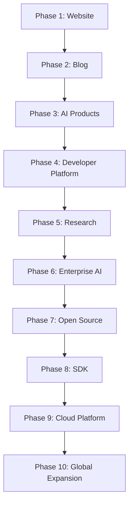

# Zydrakon AI Roadmap

This roadmap outlines the long-term vision and phase-by-phase implementation plan for the Zydrakon AI ecosystem, transitioning from an authoritative website to a full developer platform and enterprise AI cloud suite.

---

## 🗺️ Phases Overview

---

## 📅 Detailed Phases

### 🛠️ Phase 1: Website (Current)
*Goal: Establish a premium, high-performance web presence with robust SEO and GEO foundations.*
- [x] Migrate to Astro SSG for near-instant page load times.
- [x] Create Home, About, Founder, Products, Research, and Contact pages.
- [x] Apply a dark-mode, glassmorphic design system using Tailwind CSS.
- [x] Integrate structured data JSON-LD schemas (Organization, Person, Website, ItemList).
- [x] Implement AI crawler optimization with `llms.txt` and customized `robots.txt`.
- [x] Deploy to production on Vercel.

### 📝 Phase 2: Blog
*Goal: Publish technical engineering blogs, insights, and architecture deep dives.*
- [ ] Implement Astro Content Collections for MD/MDX blog post parsing.
- [ ] Launch engineering blog with RSS feed subscription.
- [ ] Add RSS Feed (`/rss.xml`) and Image Sitemap for rich indexing.
- [ ] Publish regular deep dives on agent memory systems, tool-use abstractions, and RAG pipelines.

### 🤖 Phase 3: AI Products
*Goal: Introduce interactive previews and product showcase platforms.*
- [ ] Create detailed landing pages for Forge SDK, Nexus AI Platform, and Sentinel AI.
- [ ] Build interactive web-based playgrounds for users to test Forge agent actions.
- [ ] Set up user registration and client dashboards for product beta sign-ups.

### 💻 Phase 4: Developer Platform
*Goal: Launch the documentation portal and developer console.*
- [ ] Initialize the documentation engine (`/docs`) with MDX.
- [ ] Add comprehensive API references, quickstarts, and integration guides.
- [ ] Introduce developer console for API key management and usage analytics.

### 🔬 Phase 5: Research
*Goal: Showcase technical breakthroughs and publish white papers.*
- [ ] Open the dedicated Research Hub on the website.
- [ ] Publish formal PDF white papers for the Forge protocol and Sentinel safety mechanisms.
- [ ] Integrate interactive graphs and datasets demonstrating model safety and reasoning benchmarks.

### 🏢 Phase 6: Enterprise AI
*Goal: Roll out enterprise features for Nexus AI Platform.*
- [ ] Enable Enterprise Single Sign-On (SSO) and Role-Based Access Control (RBAC).
- [ ] Implement audit logs, compliance reporting, and real-time security alerts.
- [ ] Launch private cloud and on-premise deployment configurations.

### 🔓 Phase 7: Open Source
*Goal: Foster community engagement through open-source initiatives.*
- [ ] Establish the Zydrakon GitHub open-source organization.
- [ ] Release core utilities, CLI tools, and agent templates under MIT licenses.
- [ ] Launch contributing programs, issue templates, and community discussion boards.

### 📦 Phase 8: SDK
*Goal: Release Forge SDK (v1.0.0).*
- [ ] Publish stable Forge SDK npm package for TypeScript and pip package for Python.
- [ ] Release production-ready tool-use, memory, and multi-agent coordination wrappers.
- [ ] Partner with early adopter startups to refine developer experience and API design.

### ☁️ Phase 9: Cloud Platform
*Goal: Scale to a serverless agent hosting cloud.*
- [ ] Launch Zydrakon Agent Cloud for serverless deployment of Forge agents.
- [ ] Integrate automatic scaling, execution tracking, and billing analytics.
- [ ] Provide global low-latency edge deployment for agents.

### 🌍 Phase 10: Global Expansion
*Goal: Establish brand leadership and localized operations.*
- [ ] Implement multi-lingual support (i18n) across all documentation and product consoles.
- [ ] Roll out regional hosting zones (EU, APAC, US) to comply with data residency standards.
- [ ] Launch developer conferences, hackathons, and global partner integrations.
